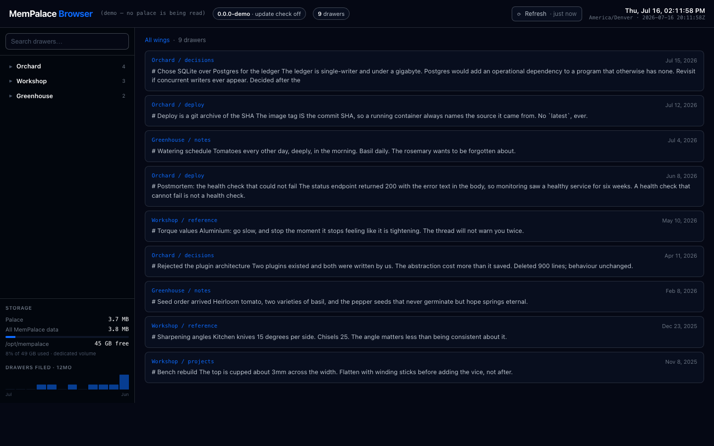

# MemPalace Browser

> A fast, read-only web browser for your private [MemPalace](https://github.com/MemPalace/mempalace).

MemPalace stores your AI's memory as drawers, filed into rooms and wings. It is optimised for
agent retrieval — an agent asks, and the right memories come back. This is the human view of the
same data: browse the wings, read the drawers, search the lot, and find out what is actually in
your palace — including the parts of it that are empty.

One file, standard library only, no database of its own, no build step.

> **Unofficial.** This is a community tool from [HenderLabs](https://henderlabs.com). It is not
> affiliated with, endorsed by, or maintained by the MemPalace project. Bugs here are ours — please
> report them [in this repo](https://github.com/henderlabs/mempalace-browser/issues), not upstream.



## What it shows

**Drawers** — the wing → room → drawer tree, with instant client-side search over the whole
palace. Search is plain substring matching, not semantic: the entire palace ships to your browser
in one payload, so it is instant and works offline.

**Documents** — a drawer is an ~800-character verbatim chunk, so a long file reads as fragments
that start mid-sentence. This regroups chunks by `source_file` back into the document they came
from. It is a separate view rather than a level of the tree, because the miner files chunks by
topic: one file's chunks legitimately scatter across several rooms, so a document has no single
place to live. (`chunk_index` restarts per room, which this accounts for.)

**Layers** — what your palace actually contains, with coverage. A palace offers closets, halls,
entities, hallways, tunnels and a knowledge graph, and in most palaces most of them have never
been written to. Nothing tells you that — an empty knowledge graph answers a query with
`count: 0`, which reads as *"there are no such facts"* rather than *"this layer is empty"*. This
panel is the difference between those two. A layer it cannot read says **unavailable**, never zero.

**System status** — one chip, honest in both directions. It reads `Healthy · 0 warnings` rather
than `Healthy`, because a badge looks identical whether it checked and found nothing or never
checked at all. It never shows green while a warning is live.

**Host** *(opt-in)* — CPU load and memory for the machine, if you want them. See
[Configuration](#configuration).

## Warnings come with a fix

When something is wrong, the browser tells you **what is wrong, why it matters, what to run, how
to verify it worked, and how to undo it** — and offers to hand the whole advisory to your agent as
one self-contained prompt.

**It never applies the fix itself, and it never will.** This program is read-only by construction,
and it answers with no authentication. A *"Fix it"* button would be unauthenticated remote command
execution on the machine holding your memory. But MemPalace is a tool for agents — so an accurate
diagnosis *is* the actuator. Copy it, hand it to your agent, let the agent do the work.

Where more than one fix is legitimate, it shows both with the tradeoff stated instead of picking
for you. Where a fix is not verified, it says so and offers no command — an unverified fix is
worse than none when the wrong guess deletes drawers.

## Status

Working and in daily use. Best-effort maintenance: issues and PRs are welcome, but no support or
response time is promised. See [Contributing](#contributing).

## Requirements

- MemPalace installed and a palace with drawers in it
- Python 3.9+ (whatever your MemPalace runs on)
- Nothing else. No pip install, no Node, no database.

## Quick start

```bash
git clone https://github.com/henderlabs/mempalace-browser.git
cd mempalace-browser
./run.sh
```

Open <http://127.0.0.1:8080/>. `Ctrl-C` stops it.

Want to see it before pointing it at your own memory? Demo mode renders synthetic drawers and
never imports MemPalace, so it runs anywhere:

```bash
MPB_DEMO=1 ./run.sh
```

`run.sh` finds the right Python by reading the shebang of your `mempalace` command, so it works
whether you installed with `uv tool`, `pipx`, `pip`, or a venv. If it cannot find one, it tells you
what it tried and how to point it manually.

## Configuration

Everything is optional. Defaults are chosen so that running it with no configuration is safe.

| Variable | Default | What it does |
|----------|---------|--------------|
| `MPB_BIND` | `127.0.0.1` | Interface to bind. **See [Security](#security) before changing this.** |
| `MPB_PORT` | `8080` | Port to listen on |
| `MPB_ALLOWED_HOSTS` | `localhost,127.0.0.1,::1` | Extra `Host` headers to accept, comma-separated. Needed if you reach it by a hostname — e.g. `MPB_ALLOWED_HOSTS=palace.lan` |
| `MPB_CHECK_UPDATES` | `1` | `0` disables the PyPI version check — see [Network](#network) |
| `MPB_DEMO` | *(off)* | `1` renders synthetic drawers and never imports MemPalace |
| `MPB_RESOURCES` | *(off)* | `1` shows host CPU load and memory. Worth it on a box dedicated to MemPalace — the embedder loads a model into RAM and the vector index lives there too, so RAM runs out before disk does. On a shared box the numbers describe everything except your palace. Linux only; elsewhere it reports *unavailable*. |
| `MEMPALACE_PYTHON` | *(auto-detected)* | Interpreter to use, if auto-detection picks wrong |

The palace itself is located by asking MemPalace, so `MEMPALACE_PALACE_PATH` and your
`config.json` are honored automatically — there is no separate path setting to keep in sync.

## Network

**One outbound request, and you can turn it off.** On startup the browser fetches
`https://pypi.org/pypi/mempalace/json` to see whether a newer MemPalace has been released. It
sends **no palace data** — it reads one version string from a fixed URL. The result is cached for
an hour.

```bash
MPB_CHECK_UPDATES=0 ./run.sh    # no outbound requests at all
```

The version chip then reads *"update check off"* rather than implying anything about your version.
Demo mode disables it by default.

There is no telemetry, no analytics, and no other outbound traffic. If you see any, that is a bug
— please [report it](SECURITY.md).

## Security

**The default is `127.0.0.1`, and you should think before changing it.**

There is no authentication, because on localhost the operating system is the authentication. Bind
it to `0.0.0.0` and every device on your network can read every drawer — including whatever your
palace holds about your health, your work, your family, and your diary, and including the devices
on your network you have not thought about lately. Web pages that *other* devices visit can reach
it too, not just people sitting at a keyboard.

If you need it from another machine, an SSH tunnel keeps the localhost default intact and needs no
password:

```bash
ssh -L 8080:127.0.0.1:8080 you@your-palace-host
```

Only use `MPB_BIND=0.0.0.0` on a network you would hand your unlocked laptop to.

**`Host` header checking.** "Localhost is the authentication" is only true if a browser cannot be
tricked into treating this server as same-origin. A malicious web page can point its own domain at
`127.0.0.1` (DNS rebinding), and the same-origin policy then protects nothing — it could read your
whole palace through `/api/data`. So requests are rejected unless their `Host` is one you have
allowed. If you reach the browser by a hostname rather than an IP, add it:

```bash
MPB_ALLOWED_HOSTS=palace.lan ./run.sh
```

A rejected request logs the exact variable to set, so a 403 tells you what to do rather than
leaving you guessing.

## Backends

Drawer browsing is backend-agnostic — it goes through MemPalace's own collection API.

| Backend | Browsing | Storage panel |
|---------|----------|---------------|
| `chroma` | yes | yes |
| `sqlite_exact` | yes | yes |
| `pgvector` | yes | no — drawers live on another host |
| `qdrant` | yes | no — drawers live on another host |

On remote backends the storage panel says so rather than reporting misleading local disk numbers.

Checked against MemPalace **3.5.0**, the current release. Upstream's `develop` branch adds a
`milvus` backend for 3.6.0 — when that ships, drawer browsing should work untouched (it goes
through MemPalace's own collection API), but Milvus Lite is *local*, so the storage panel will
need teaching about it rather than calling it remote.

## Design notes

Three decisions are deliberate, and each one is load-bearing:

**It imports the `mempalace` package.** It does not shell out to the CLI, and it does not read
`chroma.sqlite3` directly. Both couple you to something that moves — a second install drifts out of
version sync, and Chroma's schema is internal (that is what `mempalace migrate` exists for). Running
on MemPalace's own interpreter means the browser cannot disagree with your palace about what is in
it. This is also why there is no `requirements.txt` to give it its own venv: that would recreate the
drift.

**Every read passes `create=False`.** MemPalace's `get_collection` defaults to `create=True`, so a
wrong path does not error — it silently manufactures an empty palace and reports success. The
browser also refuses to start if it reads zero drawers, because that is what a wrong path looks
like. Failing loudly beats a confident, empty page.

**Nothing claims success it did not verify.** If PyPI is unreachable, the version chip says
*"update check failed"* — never "up to date". `/api/health` returns 503 with the real error when the
palace cannot be read. A health check that cannot fail is not a health check.

## What it does not do

- **No writes.** It cannot add, edit, delete, or re-file. Use the MCP tools or the CLI for that.
- **No semantic search.** Search is instant client-side text matching over every drawer. Real
  semantic search would mean loading the embedding model and a slow startup; text matching is
  usually what you want when *you* are the one looking.
- **No graph or 3D view.** If you want those, see
  [memory-palace-web-frontend](https://github.com/tomsalphaclawbot/memory-palace-web-frontend).

## Contributing

Issues and pull requests are welcome — see [CONTRIBUTING.md](CONTRIBUTING.md). The scope is
deliberately small: one file, standard library only, read-only. That is the feature, not a phase.

Security issues go through [private reporting](SECURITY.md), not public issues.

```bash
python3 -m unittest discover -s tests -v
```

## License

[MIT License](./LICENSE) — © 2026 HenderLabs

MemPalace is a separate project, also MIT licensed, © 2026 MemPalace Contributors.
